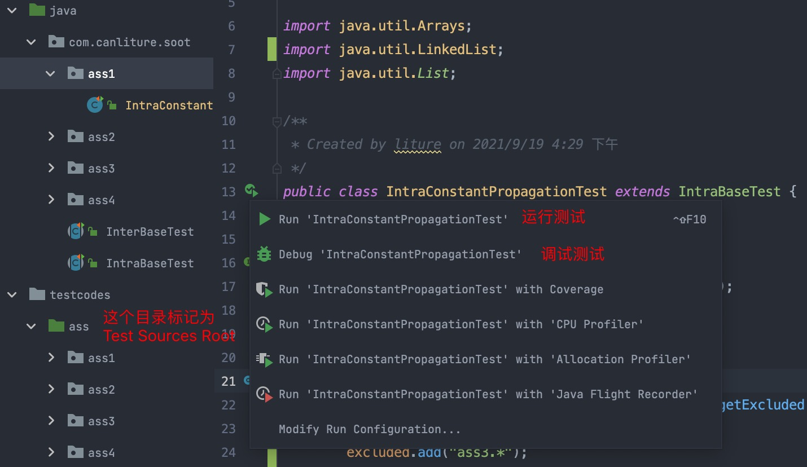

这里是南京大学软件分析课程实验作业的非官方实现

注：南大课程作业Bamboo没开源，为啥有这个仓库？
- 作业的pdf南大课程给了，API也给了；照着API，再根据自己的理解就基本上可以做了。

### 目前状态
- 还没经过大量测试(至少保证Lecture 里面的例子是没问题的)
- 第5次作业就差最后的obj/type-sensitive代码的填空了
- 希望提bug/issue
- `最近挺忙的,先停更1/2个月吧.相信这份代码仍然能够给人一些帮助.(2021-11-08)`

### 环境
- Java 8
- Soot 4.2.1
- IntelliJ IDEA
- Maven构建/Junit测试

### 文档
- docs/org为南大课程的作业原题pdf
- docs/soot为soot参考资料
- src/main/java/com/canliture/soot/每个子目录下的作业都有一个README，作为作业的简单说明

### 代码
- com.canliture.soot.ass1
  - 第一次作业的代码实现
  - 常量传播
- com.canliture.soot.ass2
  - 第二次作业的代码实现
  - 常量传播 + 活性检测 应用于死代码消除
- com.canliture.soot.ass3
  - 第三次作业的代码实现
  - CHA用于构造调用图
- com.canliture.soot.ass4
  - 第四次作业的代码实现
  - 流不敏感指针分析
- com.canliture.soot.ass5
  - 第五次作业的代码实现
  - 流敏感指针分析
  
### 测试
运行单元测试的代码: src/test/java/目录下
- com.canliture.soot.ass{n}

被测试代码: src/test/testcodes/ass/*

### 调试运行
- 使用IntelliJ IDEA时，将目录src/test/testcodes/ass标记为`Test sources root`
  - 这样就能够在调试/运行的时候自动将被测试代码编译到target/test-classes目录下，方便测试
- 以ass1的调试/运行 测试为例
  - 找到com.canliture.soot.ass1.IntraConstantPropagationTest类，运行Junit测试即可
  - 每个测试类都有一个getTransformer()方法，里面的返回的Transformer的internalTransform方法就是分析的入口了

- 对整个测试怎么跑起来, 可以查看InterBaseTest和IntraBaseTest类，这里封装个小的测试框架
  - @Before 测试前先配置一下Soot
  - @Test 执行测试代码
  - @After 输出Jimple IR到sootOutput目录下
  

